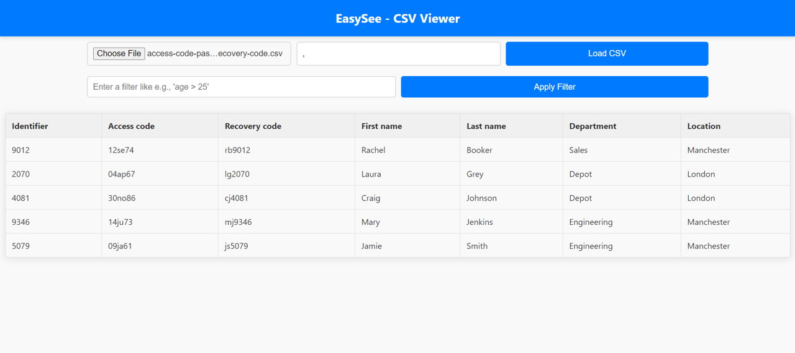
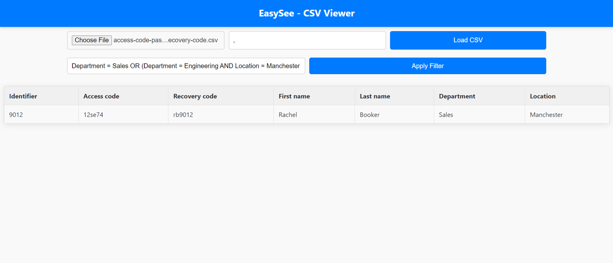
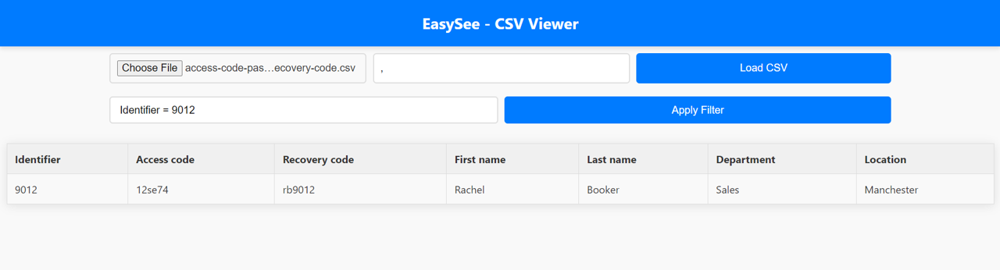
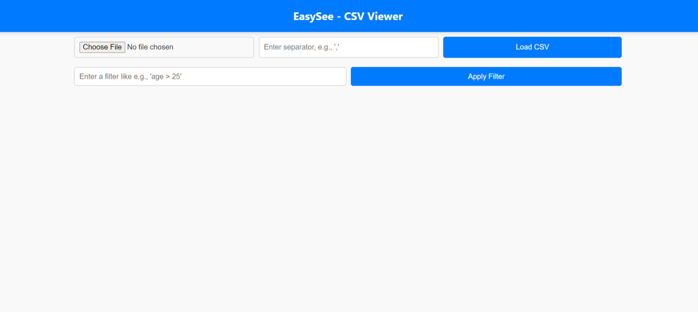

# EasySee - CSV Viewer

EasySee is a user-friendly web application that allows users to easily view and filter CSV (Comma Separated Values) files. It features a simple interface for loading CSV files, customizing separator characters, and applying SQL-like queries to filter data.

## Features

- Load CSV files using a file input.
- Customizable field separator.
- Apply SQL-like filter queries.
- Responsive table display of CSV content.

## Installation

No installation is necessary for the web version. To set up your own local version:

1. Download the source code from the repository.
2. Open the `index.html` file in a web browser.

## Usage

1. **Loading a CSV File:**
   - Click on the "Choose File" button to select a CSV file from your local system.
   - Enter the separator character used in your CSV file (default is a comma `,`).
   - Click "Load CSV" to display the CSV content in the table.

   

2. **Applying Filters:**
   - Enter a SQL-like query in the filter input box. Example: `Identifier = 9012`.
   - Click "Apply Filter" to refine the displayed data according to your query.

   

   Filters can include logical operators like `AND`, `OR`, `NOT`, and inequality `!=`.

   

3. **Initial View:**
   - When you first open EasySee, it will prompt you to load a CSV file.

   

## Examples

Here are some example queries you can apply:

- `Identifier > 2000`: Show rows where the identifier is greater than 2000.
- `Department = Sales OR Location = London`: Show rows where the department is Sales or the location is London.
- `NOT Department = Engineering`: Show rows where the department is not Engineering.
- `Identifier != 4081 AND Location = Manchester`: Show rows where the identifier is not 4081, and the location is Manchester.

## License

EasySee is open-source software licensed under the [MIT license](LICENSE).

---
